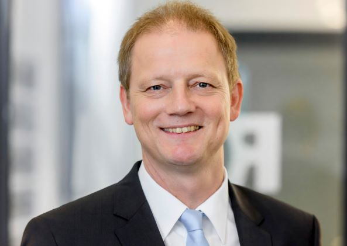

| | |
|---|---|
| Author | Dr. Bruno Lüdemann, Rud. Otto Meyer Technik GmbH & Co. KG (ROM)  |
|Title| Relevance of Dynamic Simulation of complex systems in Building Technology - review and outlook|
|Abstract| In the last three decades, simulations have been used more and more as a matter of course to answer a wide variety of questions for the planning and construction of buildings and technical building systems.  ROM Technik, as a large construction company for technical equipment of buildings, has been using these possibilities intensively for its own projects for over 30 years and is actively involved in the development and integration of simulation tools into the overall construction process. From the lecturer's many years of practice as research assistant and at ROM R&D, examples will be shown to illustrate the growing importance and acceptance of simulations in practice and to present the deeper anchoring in the digital construction process that is currently being strived for the future. |
