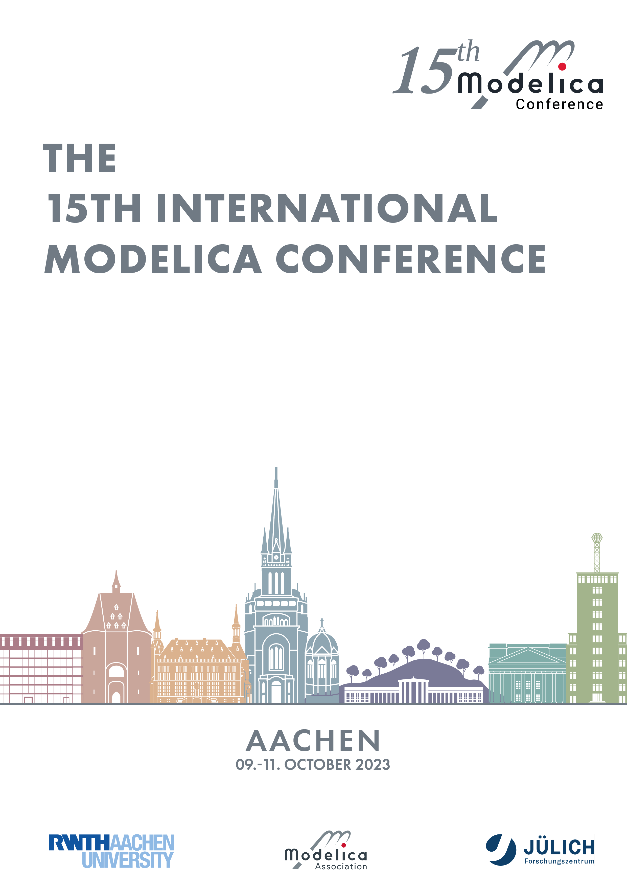

The **15th International Modelica Conference** was organized as an in-person event, held in the city of Aachen, Germany from **October 9-11, 2023**. It is organized by [The institute for Energy Efficient Buildings and Indoor Climate, RWTH Aachen University](https://www.ebc.eonerc.rwth-aachen.de/cms/~dmzz/E-ON-ERC-EBC/?lidx=1), in cooperation with the [Modelica Association](https://modelica.org/association).

We were happy having you here in Aachen. You can revisit highlights of the conference in this online [photo-collection](https://kunden.braun-foto.com/modelica23)
Photos are licensed under Modelica 2023 © 2023 by Martin Braun is licensed under Attribution-NonCommercial-NoDerivs 4.0 International ([https://creativecommons.org/licenses/by-nc-nd/4.0/](https://creativecommons.org/licenses/by-nc-nd/4.0/))

### Conference board:

- Prof. Dirk Müller, RWTH Aachen University, Germany (Conference chair)
- Prof. Antonello Monti, RWTH Aachen University, Germany
- Prof. Andrea Benigni, Forschungszentrum Jülich GmbH, Germany
- Prof. Martin Otter, Deutsches Zentrum für Luft- und Raumfahrt, Germany
- Prof. Francesco Casella, Politecnico di Milano, Italy
- Assistant Prof. Martin Sjölund, Linköping University, Sweden
- Dr. Michael Tiller, Realis Simulation, U.S.A.

